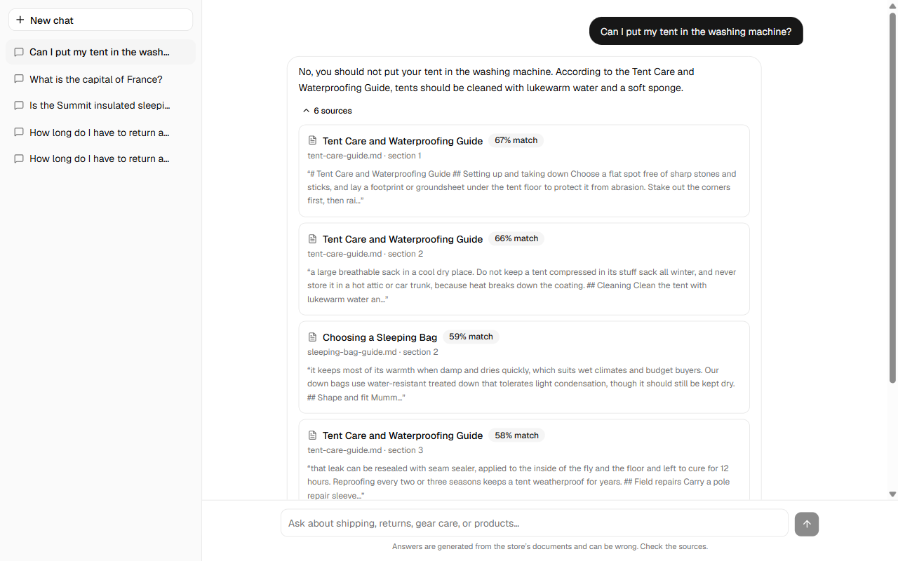

# Chat RAG Bot V1

A retrieval-augmented chatbot for a fictional outdoor-gear shop (*Northwind Outfitters*).
It answers from two data sources, shows the sources under every reply, and runs entirely
on your machine: no API keys, no cloud.

| Layer | Choice |
|---|---|
| Frontend | Next.js 16 (App Router), Tailwind CSS, shadcn/ui |
| Backend | Django 5.2 + Django REST Framework (container 1) |
| Relational DB | MySQL 8.4: conversations, messages, products (container 2) |
| Vector store | PostgreSQL 16 + pgvector: document chunks and embeddings (container 3) |
| LLM | Ollama running **inside the backend container** (default `llama3.2:3b`) |
| Embeddings | Hugging Face `BAAI/bge-small-en-v1.5` (384 dims) via sentence-transformers |



## Quick start

Requirements: Docker Desktop (or Docker Engine + Compose v2), about **12 GB RAM** given to Docker,
about **10 GB** of free disk, and a network connection for the first start.

```bash
cp .env.example .env            # then change the passwords in .env
docker compose up -d --build    # first build takes a few minutes
make ingest                     # loads the sample products and documents
```

Open **http://localhost:3000**.

The first start downloads the language model (about 2 GB) and the embedding model (about 130 MB) into
Docker volumes. The UI shows a "still starting up" banner until they are ready, and you can follow
progress with `docker compose logs -f backend`. Later starts take under a minute.

Check everything end to end (uses the real models):

```bash
make smoke        # or: python scripts/smoke_test.py --wait 900
```

Without `make` (for example on Windows): use the `docker compose ...` commands shown in the [Makefile](Makefile).

## How it works

```
Browser --> Next.js :3000 --/api/*--> Django :8000 --> MySQL          conversations, messages, products
                                          |
                                          +--> PostgreSQL + pgvector   document chunks (cosine search)
                                          +--> sentence-transformers   embeds the question (in process)
                                          +--> Ollama :11434           generates the answer (same container)
```

One question, step by step (`POST /api/chat`):

1. **Retrieve documents.** The question is embedded and the closest chunks are fetched from pgvector.
   Chunks farther than `RAG_MAX_DISTANCE` are dropped.
2. **Retrieve products.** Keywords from the question are matched against the MySQL `Product` table.
3. **Decide.** If nothing relevant was found, the bot answers with a fixed "I don't know" message and the
   LLM is not called. (Small models do not reliably refuse off-topic questions, so this is enforced in code.)
4. **Prompt.** System instructions ("answer only from the context, never guess") + the retrieved context +
   the last `RAG_HISTORY_TURNS` messages + the question. A short follow-up such as *"what about Canada?"*
   borrows the previous question for retrieval.
5. **Stream.** The answer arrives as server-sent events: `token`, then `sources`, then `done`.
6. **Persist.** The exchange is saved **only after a complete answer**. If the model fails, or you press
   Stop, nothing is stored, so a conversation never contains half an answer.

Failures before the first token return a real HTTP error (502); failures mid-stream arrive as an `error` event.

## Configuration

Everything is set in `.env` (see [.env.example](.env.example)). The ones you are most likely to change:

| Variable | Default | Meaning |
|---|---|---|
| `OLLAMA_MODEL` | `llama3.2:3b` | Any model from the Ollama library. Bigger = better answers, slower on CPU. Pulled on first start. |
| `EMBEDDING_MODEL` / `EMBEDDING_DIM` | `BAAI/bge-small-en-v1.5` / `384` | Must be a sentence-transformers model. The dimension must equal the model's output **and** the database column. |
| `RAG_TOP_K` | `4` | Document chunks per question |
| `RAG_MAX_DISTANCE` | `0.45` | Relevance cutoff (cosine distance). Tuned on the sample docs: on-topic 0.18-0.41, off-topic 0.48-0.58. **Re-tune it if you change the model or the documents.** |
| `RAG_HISTORY_TURNS` | `6` | Recent messages sent to the model |
| `LLM_PROVIDER` / `EMBEDDING_PROVIDER` | `ollama` / `huggingface` | Set to `fake` for offline demos and tests |
| `MYSQL_HOST_PORT`, `POSTGRES_HOST_PORT` | `3307`, `5433` | Host ports (localhost only) |

### Using your own documents

Put `.md` or `.txt` files in `backend/data/sample_docs/` (or pass `--path`), rebuild, and run
`docker compose exec backend python manage.py ingest_documents --reset`.
Debug retrieval without the LLM: `docker compose exec backend python manage.py search_vector_store "your question"`.

### Changing the embedding model

Vectors from different models are not comparable. If you change `EMBEDDING_MODEL` you must re-ingest
(`ingest_documents --reset`). If the new model has a different size you also need a migration for
`DocumentChunk.embedding`. Ingest and chat refuse to run with a mismatch and tell you why.

### NVIDIA GPU

`docker compose -f docker-compose.yml -f docker-compose.gpu.yml up -d --build`. This keeps the CUDA
libraries in the image and reserves the GPU. **Untested**: it was written on a CPU-only machine.

## Project layout

```
backend/
  config/            settings, DB router (rag -> pgvector, everything else -> MySQL)
  chat/              models, REST + SSE views, health checks, product fixture
  rag/               embedder, chunker, ingest, retriever, product search, prompt, pipeline, LLM providers
  data/sample_docs/  the demo knowledge base
  tests/             pytest (offline: fake LLM and embedder; real Postgres/MySQL)
frontend/
  src/app/api/       runtime proxy to the backend (streams SSE, forwards client aborts)
  src/components/    chat UI + shadcn/ui primitives
  src/lib/           SSE parser, stream client, API client (vitest unit tests)
scripts/smoke_test.py   end-to-end check of a running stack
docs/screenshots/
```

## Development

```bash
make test             # backend tests, inside the running container
make test-frontend    # frontend unit tests (needs: cd frontend && npm ci)
cd frontend && npm run dev    # hot-reload UI on :3000, with BACKEND_URL=http://localhost:8000
```

The backend image copies the code at build time, so re-run `docker compose up -d --build backend` after a change.

## Known limitations

- **No authentication.** Anyone who can reach the ports can chat and delete conversations. Ports are bound
  to `127.0.0.1` and the database passwords in `.env.example` are placeholders. Do not expose this as is.
  Sessions and history are not per user.
- **CPU speed.** With a 3B model on CPU, a question with fresh context can take around 10 s to the first token,
  then a few tokens per second. Repeats of a similar prompt are faster (Ollama caches the prompt prefix).
- **Small-model mistakes.** The model sometimes omits a detail that is in the context (for example a price) or
  contradicts the source it quotes. The sources shown under each answer are there so you can check.
- **Product search is keyword based** and scans the whole (small) table. Use MySQL full-text search for a real catalog.
- **Matching is English only.**
- The GPU compose override is untested.

## Troubleshooting

| Symptom | Cause / fix |
|---|---|
| Banner says the language model is still starting | First-start download. `docker compose logs -f backend` |
| `HTTP 503` from Hugging Face in the logs during the first start | Transient on their side; the client retries automatically |
| Every question gets the "I don't know" reply | Nothing ingested (run `make ingest`), or `RAG_MAX_DISTANCE` is too strict for your documents |
| Ingest or chat fails with a "dimension" error | `EMBEDDING_DIM` does not match the model; see *Changing the embedding model* |
| Out-of-memory / very slow | Give Docker more RAM, or use a smaller `OLLAMA_MODEL` |
| Port already in use | Change `MYSQL_HOST_PORT` / `POSTGRES_HOST_PORT`; for 3000/8000 edit the `ports:` in `docker-compose.yml` |
| `docker compose down -v` | Deletes both databases **and** the downloaded models |
